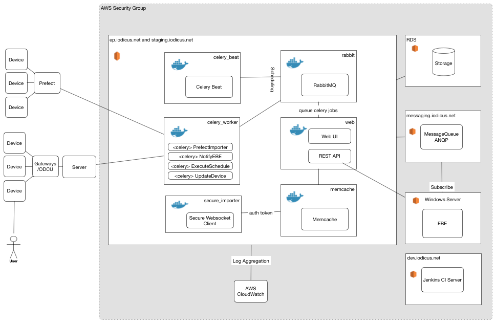

# Overview

# ep.iodicus.net Containers

## Web
Web server. The container hosting EC2 instance runs an nginx server as a proxy. The web container runs gunicorn. 

### Rest API
Used by EBE and Mobile Client

### Web UI
Admin and analytics interface 

## Celery Worker
Task list
- import from prefect (each 300s)

## Celery Beat

## Secure Importer
Websocket client to Secure server.

## Memcache
Holds secure server auth tokens and django cache.
The auth tokens do not expiry in the cache.

## AMQP Queue
Schedules celery tasks.
RabbitMQ.

# RDS DB
There are instances for prod and staging

# EBE
Windows Server 2012.

# Messaging.iodicus.net AMQP Queue
Running RabbitMQ (containerised).

# CI Server
Automatically builds from ep_site project pushes.